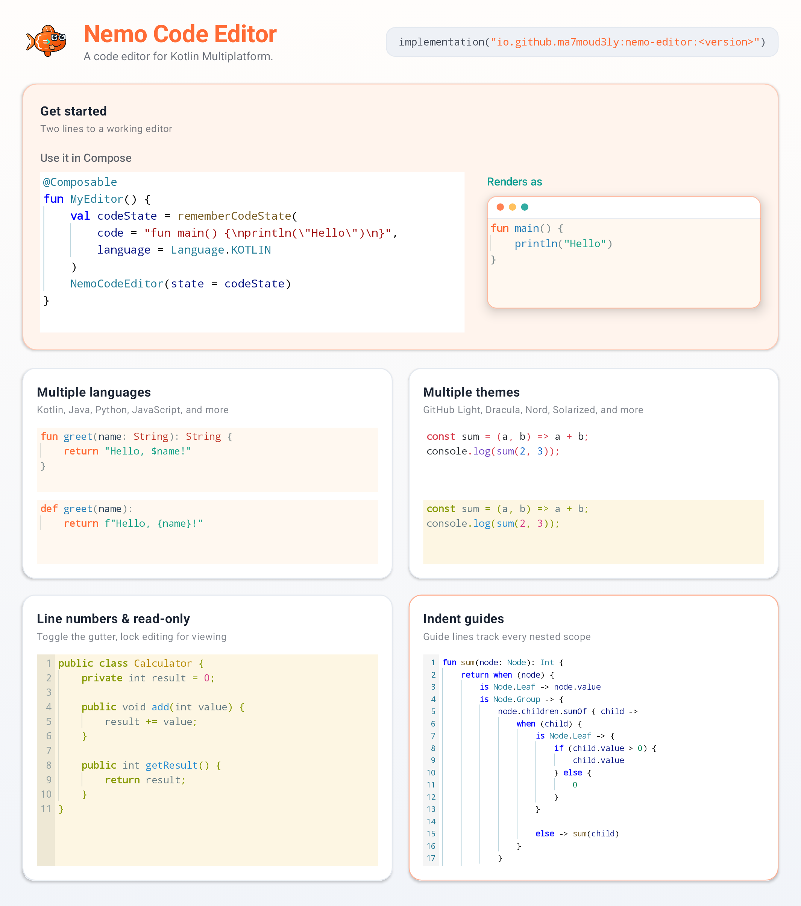
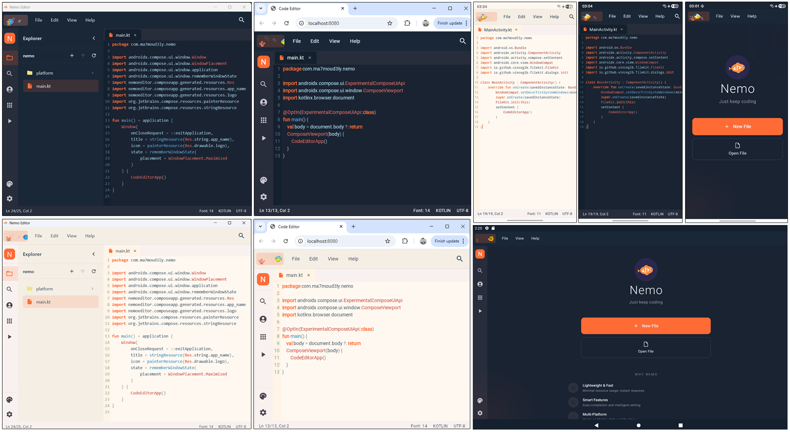

# Nemo Code Editor

A Compose Multiplatform code-editor component for Kotlin. Embed a fast, configurable editor in your Android, iOS, desktop, JavaScript, or WebAssembly app.

[](LICENSE)
[](https://klibs.io/project/Ma7moud3ly/nemo-editor)

<p align="center">
  
</p>

## What you can build

Use Nemo Code Editor wherever your Compose app needs to display or edit source code:

- Syntax-highlighted Kotlin, Python editors with formatting, autocomplete, and error detection.
- Editors for Java, JavaScript, C/C++, HTML, CSS, JSON, Markdown, SQL, and more, using the generic language fallback.
- Read-only code viewers, configuration editors, playgrounds, and custom IDE-like experiences.
- Configurable themes, font size, tabs or spaces, line numbers, indentation guides, auto-indent, and autocomplete.
- Stateful editing with selection, cursor control, undo/redo history, and change tracking.

## Get started

### Add the dependency

Add Nemo Code Editor to `commonMain` in your Kotlin Multiplatform project:

```kotlin
commonMain.dependencies {
    implementation("io.github.ma7moud3ly:nemo-editor:1.0.4")
}
```

You can also find the published package on [Klibs](https://klibs.io/project/Ma7moud3ly/nemo-editor).

### Render an editor

```kotlin
import androidx.compose.foundation.layout.fillMaxSize
import androidx.compose.runtime.Composable
import androidx.compose.ui.Modifier
import io.ma7moud3ly.nemo.NemoCodeEditor
import io.ma7moud3ly.nemo.model.Language
import io.ma7moud3ly.nemo.model.rememberCodeState

@Composable
fun KotlinEditor() {
    val state = rememberCodeState(
        code = """
            fun main() {
                println("Hello from Nemo")
            }
        """.trimIndent(),
        language = Language.KOTLIN,
    )

    NemoCodeEditor(
        state = state,
        modifier = Modifier.fillMaxSize(),
    )
}
```

### Configure it

```kotlin
val settings = remember {
    EditorSettings(
        theme = EditorThemes.NEMO_DARK,
        tabSize = 4,
        showLineNumbers = true,
        showIndentGuides = true,
        enableAutocomplete = true,
    )
}

NemoCodeEditor(
    state = state,
    settings = settings,
    modifier = Modifier.fillMaxSize(),
)
```

`EditorSettings` is reactive, so its theme, font, indentation, and read-only state can be changed while the editor is on screen. See the [NemoCodeEditor API documentation](docs/NemoCodeEditor.md) for the full API and additional examples.

## Nemo Editor app

This repository also contains **Nemo Editor**, a complete cross-platform code-editor application built with this library. It is a practical reference for integrating the component with file browsing, tabs, find and replace, and platform file operations.

<p align="center">
  
</p>

- [Android on Google Play](https://play.google.com/store/apps/details?id=io.ma7moud3ly.nemo)
- [Try the web app](https://nemo-editor.web.app/)
- [Download a GitHub release](https://github.com/Ma7moud3ly/nemo-editor/releases)

## Build the app from source

```bash
git clone https://github.com/Ma7moud3ly/nemo-editor.git
cd nemo-editor

# Desktop app
./gradlew :desktopApp:run

# Android app
./gradlew :androidApp:installGmsDebug

# Web app
./gradlew :webApp:wasmJsBrowserDevelopmentRun
```

To publish the library to your local Maven repository:

```bash
./gradlew :nemo-editor:publishToMavenLocal
```

## Contributing

Contributions are welcome. Please follow Kotlin coding conventions, include tests where appropriate, and update documentation for user-facing changes. Open an [issue](https://github.com/Ma7moud3ly/nemo-editor/issues) or pull request to get started.

## License

Nemo Code Editor is available under the [MIT License](LICENSE).
